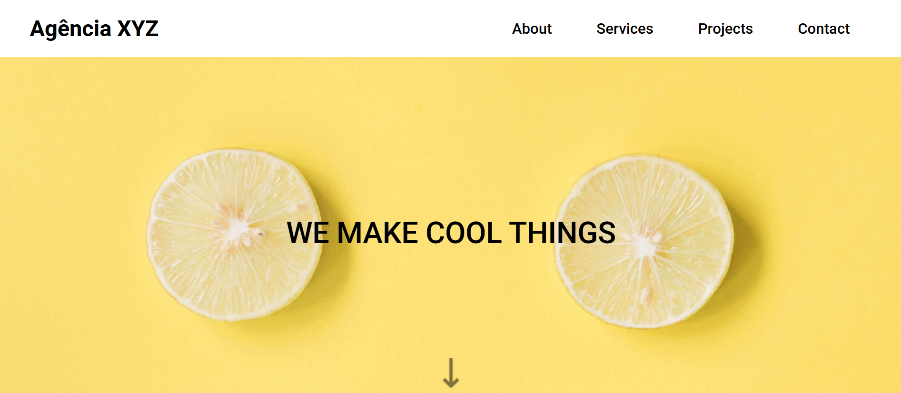

# Agência XYZ

Este é um projeto de landing page para a **Agência XYZ**, desenvolvido com **HTML, CSS e JavaScript**.

## 📌 Tecnologias Utilizadas

- HTML5
- CSS3
- JavaScript
- Google Fonts
- Font Awesome

## 📂 Estrutura do Projeto

```
/
├── src/
│   ├── css/
│   │   ├── reset.css
│   │   ├── variables.css
│   │   ├── style.css
│   │   ├── menu.css
│   ├── images/
│   ├── js/
├── index.html
```

## 🎯 Funcionalidades

- Página responsiva
- Menu hambúrguer
- Seções para **Sobre**, **Serviços**, **Projetos** e **Contato**

## 🛠 Como Rodar o Projeto

1. Clone o repositório:
   ```sh
   git clone https://github.com/seu-usuario/nome-do-repositorio.git
   ```
2. Acesse a pasta do projeto:
   ```sh
   cd nome-do-repositorio
   ```
3. Abra o arquivo `index.html` em um navegador.

## 📸 Screenshots



## 📄 Licença

Este projeto está sob a licença MIT - sinta-se à vontade para utilizá-lo e modificá-lo.

Criado por Alan Borges 🚀
